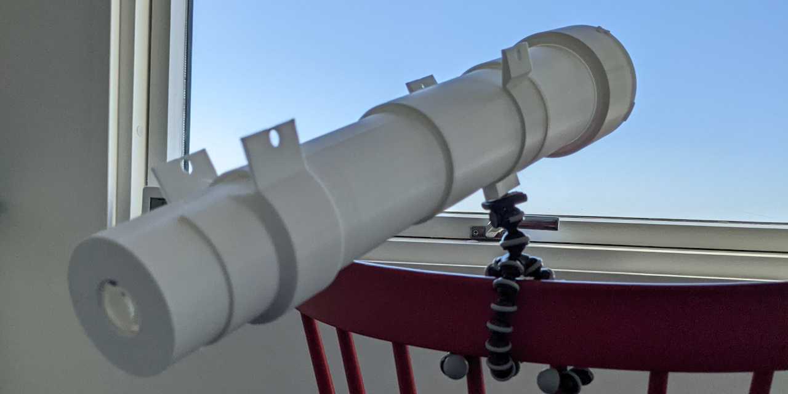
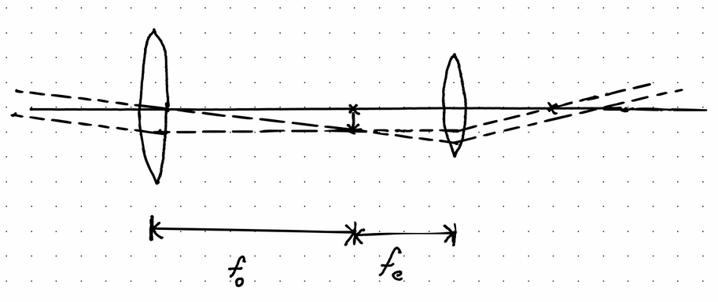
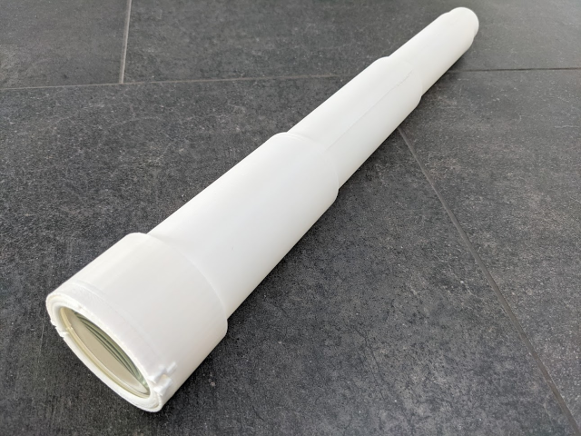
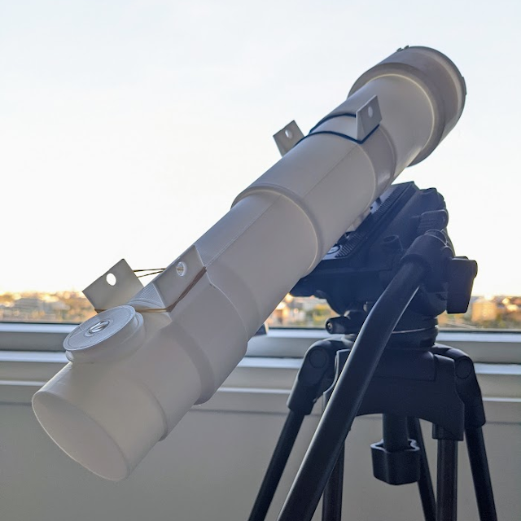

# The poor man's telescope 🔭

This is a crude and simple telescope that doesn't assume any major knowledge about astronomy in order to get a glance of our neighborhood in the universe. It's is a Keplerian style telescope which should be the most simple telescope to build.

A Keplerian style telescope consists of two convex lenses which allow for a wider field of view compared with the Galilean telescope. Apart from the two lenses, the only additional parts needed is this “print in place” telescope tube which also includes the lens holder for the objective and eyepiece / ocular.

The big challenge when building this telescope is to find two convex lenses. The focal length, diameter and the thickness of the lens are parameters that the telescope tube must adapt to.
Luckily there is no need to provide a stl file for each combination of lenses. Use OpenCAD and specify your settings in the Spreadsheet.

The following parameters will let you create a telescope based on the lenses that you have. 

| LENS SETTINGS                    | (mm) |                                                  |
|----------------------------------|------|--------------------------------------------------|
| Objective lens radius            | 25   | The diameter of the objective lens               |
| Objective lens thickness         | 2.5  | The outer thickness of the objective lens        |
| Objective focal length           | 300  | The focal length of the objective lens           |
| Eyepiece / Ocular lens radius    | 15.1 | The radius of the eyepiece / ocular lens         |
| Eyepiece / Ocular outher radious | 18   | The outher radius of the eyepiece                |
| Eyepiece / Ocular focal length   | 50   | The focal length of the eyepiece / ocular lens   |
| Eyepiece / Ocular thikness       | 2.00 | The thikness of the eyepiece / ocular lens       |

The two convex lenses of a Keplerian telescope must have different focal lengths. The light enters the telescope through the objective lens and exits the telescope through the eyepiece lens.

The light from far away objects enters the telescope in parallel. The parallel light will forms an inverted images at the focal point of the objective lens. That inverted image will the be converted back to parallel light by the eyepiece as long as the lens has it's focal point on the virtual image.

To calculate the magnification of a telescope, simply calculate:

magnification = focal length of the objective / focal length of the eyepiece.

## How to print the telescope

A recommended setup for printing is to print with PLA using raft and 0% infill.

The simplest version of the telescope after being printed.

The result will be a binocular when assembled with an objective lens and a eyepiece lens.

A more complex version which also needs a mirror will result in a telescope, where standar eyepieces can be used.

## Telescope assembly 

The assembly should mostly be self explanatory.

## Result from different prints 

(f = focal length in mm, r = radius in mm):

| Objective (f,r) | Eyepiece (f, r) | Craters are visible on the moon | Comments |
|-----------------|-----------------|---------------------------------|----------|
| 150, 25         | 50, 15          | No                              | Gives a good field of view which make this suitable for children |
| 300, 25         | 50, 15          | No                              | Significant effect of chromatic aberration. Slightly more magnification is needed to clearly spot the largest crater on the moon |
| 400, 40         | 20, 10          | Yes                             | |
| 400, 40         | 10, 5           |  Yes                            | It's easy to get a sharp image using a 10mm eyepiece |

# Disclaimer
THIS CAD DRAWING COMES WITH NO WARRANTIES, USE AT YOUR OWN RISK. NEVER POINT A TELESCOPE BUILT FROM THIS DRAWING AT THE SUN OR ANY OTHER STRONGLY BRIGHT SOURCES.
