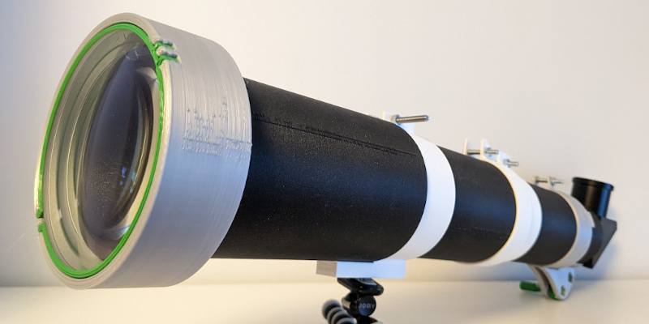
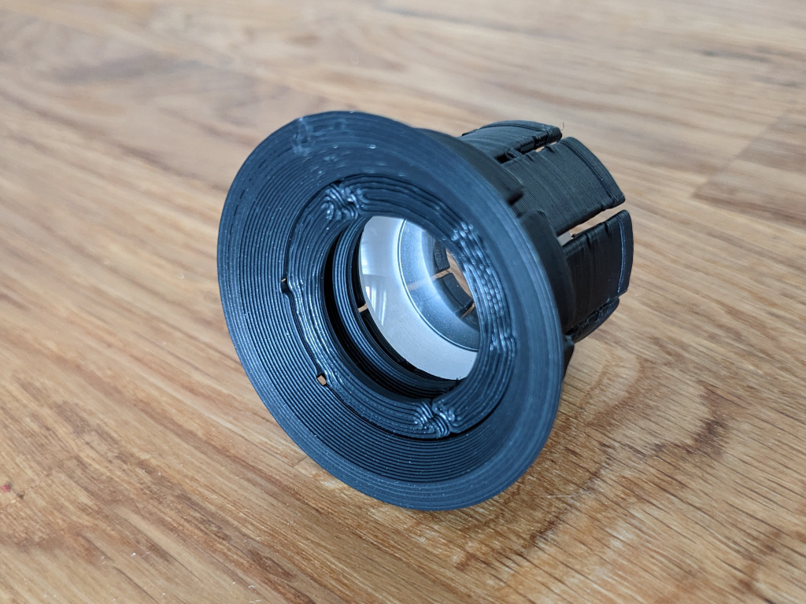
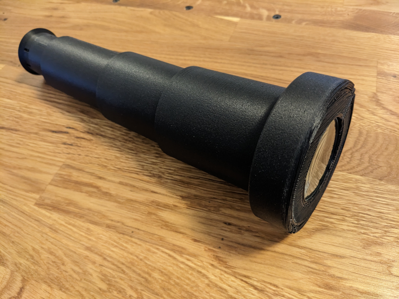

# A poor man's telescope 🔭

This project will let you explore the basics of creating your own DIY telescope. The project will unfold into a series of challenge, beginning from the simplest possible variant of a telescope and ending up with an advanced set-up that allows you to see the rings of Saturn, or the red spot on jupiter. That's the goal at least, the focus and other components must be improved before the telescope can be used for viewing planets.

*A work in progress version of the telescope.*

## What will you need

* A 3d printer loaded with some PLA filament
* An objective lens
* An eyepiece [DIY eyepiece](the-eyepiece.md)
* A tripod is necessary for the later stages

## Introduction level - The Galilean telescope

The first telescope ever created used a concave lens eyepiece. It was invented by Hans Lippershey and later used by Galileo during his early observations of space. If you want to replicate this early design, you will need a concave lens with a diameter of around 24.4 mm or smaller and a focal length of around -25mm. Use this lens to print a negative [eyepiece](the-eyepiece.md), which you can assemble with your telescope.

When using a Galilean telescope, which has a concave eyepiece, you will notice a different field of view compared to Keplerian telescopes

## Introduction level - The Keplerian telescope

A keplarian telescope is one of the first variants of telescope used. Building one gives you an understanding of the equipment used in the very begining of when humans started to use telescopes.

Using inexpensive lenses is acceptable for this variant of the telescope, as the simple variant of the focuser does not provide high precision. The challenge here could be to find a setup where the craters on the moon can be seen with a a total costs of less than 10 euro.

you'll definitely experience chromatic aberration if you go for a cheap lens, but you should be able to get a some what clear image with 15 times magnification.

The parts for this setup is can be downloaded on [Thinigiverse - A poor man's refractor telescope](https://www.thingiverse.com/thing:5895403).

## The happy amateur level - Aiming for the moon

The moon is probably the first object in the sky that you would explore. Still, It's not that unlikely that you have never seen the amazing structure of the moon. The mountains and the craters are just out of reach for the human eye. What would it take to get a clear and sharp image of the moon where you can see that there are actually mountains an craters present on the moon?

What you'll need is to spend some money on an achromatic lens.

This [gearbox](https://github.com/leonardsaers/3d-printable-designs/tree/main/simple-gearbox) will let you fine adjust the focuser tube with a precition of 0.1 mm.

This part of the challenge is still being worked on. The precision of the focuser needs to improve before thingiverse project can be created.

A detailed description on how to build the more advanced telescope will be added.

## The expert level - Spotting the rings of Saturn

The current setup is not yet ready for this challenge.

# Disclaimer
THIS CAD DRAWING COMES WITH NO WARRANTIES, USE AT YOUR OWN RISK. NEVER POINT A TELESCOPE BUILT FROM THIS DRAWING AT THE SUN OR ANY OTHER STRONGLY BRIGHT SOURCES.
