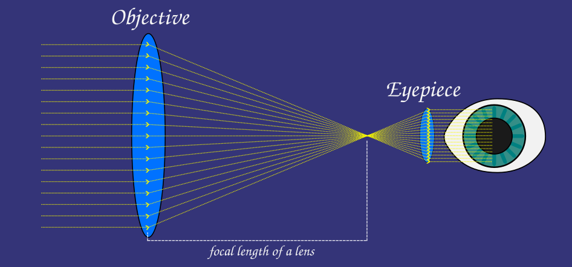
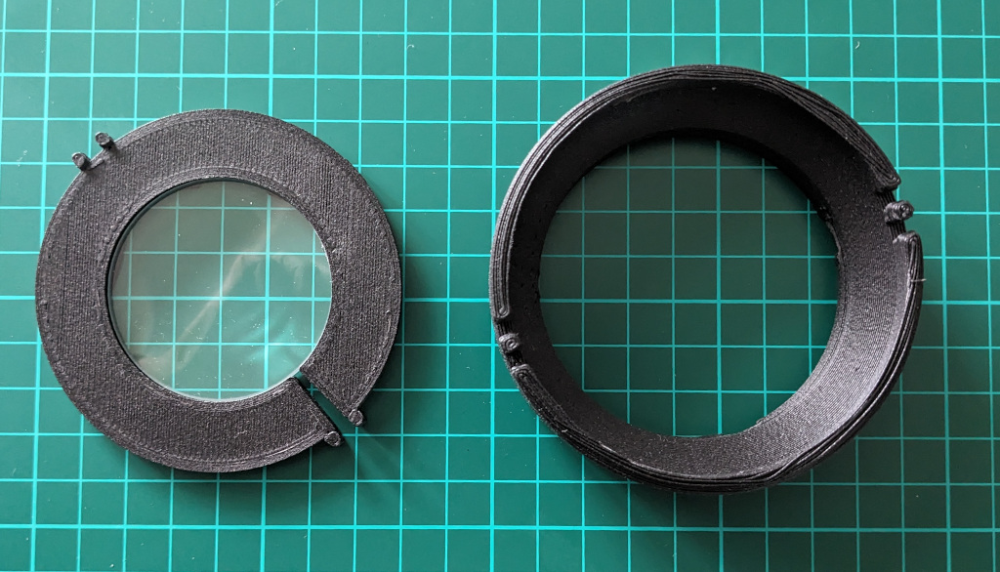

# Instruction for the introduction level (text for thingiverse and printable)

While achieving the same quality as a factory-made telescope may be challenging, there's something truly exciting about building your own telescope. Maybe it's the joy of handling lenses, seeing how they magnify, and then putting the telescope together to help you see faraway things more clearly. Or maybe it's the drive to understand the conditions that astronomers faced in the 15th century. This description outlines how you can easily construct a telescope on par with the instruments that Galileo and Kepler worked with. Below, is first a brief explanation of optics which briefly describes how a telescope gathers light and then the instruction how to build this telescope. For a deeper understanding of optics, a course in basic optics is recommended.

## A telescope in it's simplest form

A telescope in it's simplest form is made up of two lenses. The light enters the telescope through a lens that is called the objective lens and than leaves the telescope through a lens that is called the eye piece. There are other kinds telescope kinds of telescopes that uses several lenses, or a mirror, or other material to bend incoming ligth. This project will describe the most simple variant that is based on only two lenses, an objective lens and a eye piece lens.

## Light is information

We can perceive the world around us thanks to the information that light carries from various objects. Our eyes act as sensors that decode this information carried by light. Our eyes receive an abundance of information from all sorts of objects around us. Information comes at us from various angles, but luckily, the eye has a flexible lens that can be adjusted to focus on the object we are observing. This allows the information carried by the light from the object we're looking at to be the one that is displayed for us.

It's the size of the pupil in the eye that determines how much information from light we can intake. When it's dark, the pupil can expand to a diameter of 8 mm, providing an area of about 0.5 cm. If we had a larger pupil, it would enhance our ability to gather light, allowing us to see better in darkness, for instance. There are other processes in the eye that affect the capacity to absorb light, but for this description, understanding the pupil is sufficient.

What a telescope does is increase the amount of information an eye can capture while simultaneously magnifying the image that information represents. By focusing light from a large area onto a smaller one, the eye can receive more concentrated information.

A telescope with an objective lens thas has a diameter of 5 cm has an area of approximately 19.6 cm². If all that light can be collected and presented to the pupil, it provides a collecting area that is approximately 39 times larger than gathering information solely with the pupil. It's the increased area of information gathered by the eye that enables us to discern details from objects in the sky that we otherwise wouldn't be able to see.

The interaction between the objective lens and the eyepiece creates the magnification. Magnification occurs when the objective lens refracts light with a angle that is lower than the refraction angle of the eyepiece. The following formula calculates a telescope's magnification:

Magnification = Focal length of the objective / Focal length of the eyepiece

The formula for magnification is straightforward. A basic optics course can provide a deeper understanding of this relationship.

# Purchasing Optics

You need to acquire an objective lens and a 1.25-inch eyepiece. You can use a factory made eyepiece or build one of your own. The following two projectes lets you build a 1.25-inch eyepiece:

 * [Simple single lens 1,25" eyepiece](https://www.thingiverse.com/thing:5889682)
 * [1,25" Galilean Eyepiece](https://www.thingiverse.com/thing:6019325)

Acquiring an objective lens for the telescope is the most challenging part of this project. Try to find a lens that has a focal length of 30, 40 or 50 cm. The cheaper lenses are normally very thin with an edge thickness of around 2 mm and a diameter of 5 cm. You will need to create a lens enclosure that fits the lens that is intend to be used as an objective.

The following table shows some pre generated setups for lens enclosure. Leav a comment if you would like to have any other dimentsions generated, or open the free cad project to generate an eclusure after your own specification.

| stl file                        | lens diameter (mm) | lens edge thickness (mm) |
|---------------------------------|--------------------|--------------------------|
| lens-enclosure_508_18.stl       | 50,8               | 1,8                      |
| lens-enclosure_510_18.stl       | 51,0               | 1,8                      |
| lens-enclosure_511_18.stl       | 51,1               | 1,8                      |
| lens-enclosure_508_21.stl       | 50,8               | 2,1                      |
| lens-enclosure_510_21.stl       | 51,0               | 2,1                      |
| lens-enclosure_511_21.stl       | 51,1               | 2,1                      |
| lens-enclosure_508_33.stl       | 50,8               | 3,3                      |
| lens-enclosure_510_33.stl       | 51,0               | 3,3                      |
| lens-enclosure_511_33.stl       | 51,1               | 3,3                      |
| lens-enclosure_510_1101.st      | 51,0               | 11,01                    |
| lens-enclosure_511_1101.st      | 51,1               | 11,01                    |

The diameter of the objective, the general quality of the lens and the focal length are all parameters that will decide if you are able to spot the creaters on the moon.

# Building the telescope

All parts can be printed using PLA, 0,3 mm is recommended for layer heigth. Use a brim when priting the parts.

This telescope will consist of an objective that is connected to a optical tube and a focuser tube. 

Print the lens enclosure that will fit your lens.

Put the lens inside the lens enclosure.

If the lens enclosure is slightly too small, than you can adjust it using a hair dryer. Use the hair dryer to heat up the PLA, that makes the PLA soft so that it can be streched around the lens.

Push the lens enclosure on the objective.

Put the focuser tube inside the optical tube.

Push the objective on to the focuser tube.

Insert a 1.25-inch eyepiece into the focuser tube.

You now have your own telescope.

This telescope is very basic in it's design. There is a slightly more advanced version of this telescope that can be found on the projects github page: [3d-printable-telescop](https://github.com/leonardsaers/3d-printable-telescope)

## Disclaimer

NEVER POINT A TELESCOPE AT THE SUN OR ANY OTHER STRONGLY BRIGHT SOURCES. EAVEN THE MOON BECOMES SO BRIGTH THAT IT CAN DAMAGE THE EYE IF THE LENS IS WIDE ENOUGTH.
