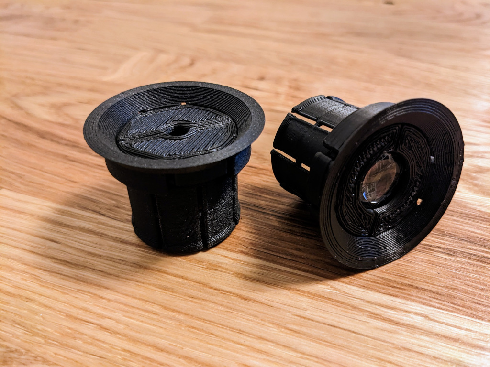

# The poor mans eyepiece

The eyepiece or ocular is the part that bends back the light that has been focused by the objective. It's the properties of the eyepiece that result in a magnified image. Some people consider it to be the most important optical component of a telescope, and that it's a part where you really should spend some money to really get the best result out of your telescope.

When building a poor man's telescope, it's actually more likely that a blurred image will result from a low-quality objective lens. You may actually be surprised how well the magnified image will turn out with just a cheep glass lens as the optical part in the eyepiece (as long as the objective lens is of descent quality).

The first telescopes used by Galileo and Kepler used a single lens setup, where Galileo used a concave lens and Kepler used a convex lens. This eyepiece is also designed to be a single lens setup.

## The 1.25 inch standard

The most popular standard size of a eyepiece is to have a diameter of 1.25 inch (31,75 mm). The poor mans telescopes is based on the 1.25 inch eyepiece size.

## What lens could be used

A convex lens with a maximum diameter of 28 mm can be used. Try to find a lens with a focal length of about 20 mm.

## Download stl files

Use the freecad drawing to customize your eyepiece or download stl files from thingiverse: [The poor mans eyepiece](https://www.thingiverse.com/thing:5889682)
